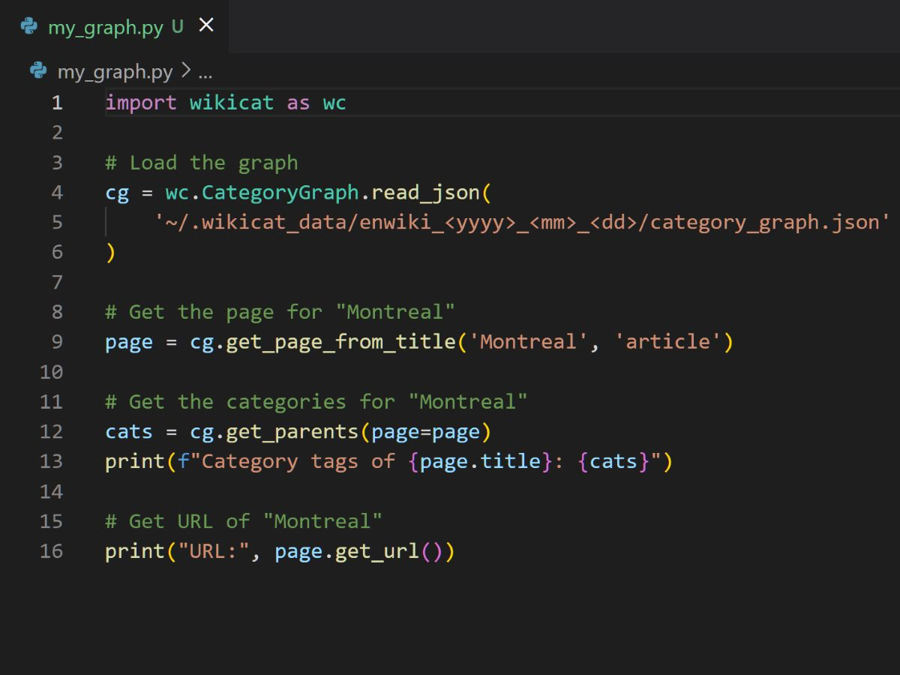
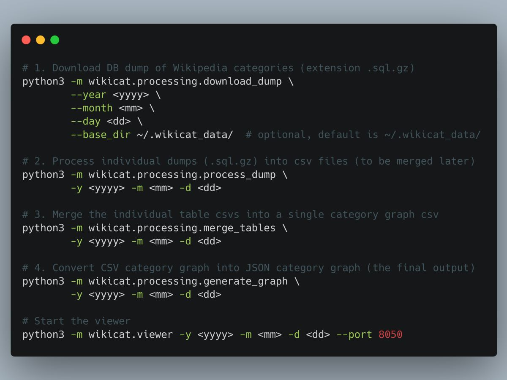
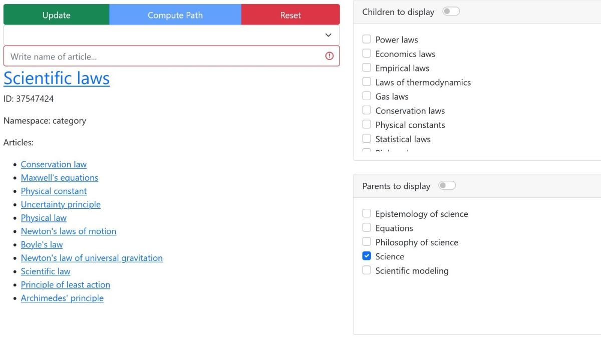

# `wikicat`

*A Python toolkit for managing and navigating graphs of Wikipedia categories 🔖*

|  |  |
|:---:|:---:|
| Simple [Python API](#main-api) for exploring graph offline | Useful CLI for [processing](#wikicatprocessing) and [launching app](#wikicatviewer) |
|  |  |
| [Interactive visualization of categories](#wikicatviewer) | [UI to display information and filter nodes](#usage) |

> **Note** If you need help at any time, you can head over to [the official documentations](https://xhluca.github.io/wikicat/).

## Main API

> **Note** The reference can be found on the [doc page](https://xhluca.github.io/wikicat/wikicat) or in [`docs/wikicat.md`](docs/wikicat.md)

The main `wikicat` API allows you work with category graphs generated from a certain dump by Wikipedia. Once the dump is processed via `wikicat.processing`, you can easily navigate the graph using simple and clear Python code, all offline (i.e., you do not need to make web requests to Wikipedia, and you can choose dump going back to any date you prefer). The API is designed to be as simple as possible, and is intended to be used by researchers and developers who want to work with the Wikipedia category graph.

To install the API, run:

```
pip3 install wikicat
```

`wikicat` contains two classes to work with the Wikipedia category graph: `CategoryGraph` and `Page`. The `CategoryGraph` class is used to load the graph from a file, and to navigate the graph. The `Page` class is used to represent a Wikipedia page, and to retrieve information about the page from Wikipedia. They are meant to be used together, as shown in the following example:

```python
import wikicat as wc

# Load the graph
cg = wc.CategoryGraph.read_json(
    '~/.wikicat_data/enwiki_<yyyy>_<mm>_<dd>/category_graph.json'
)

# Get the page for "Montreal"
page = cg.get_page_from_title('Montreal', 'article')

# Get the categories for "Montreal"
cats = cg.get_parents(page=page)
print(f"Category tags of {page.title}: {cats}")

# Get URL of "Montreal"
print("URL:", page.get_url())
```

By default, the path will be `~/.wikicat_data/`, but the JSON can be stored anywhere you want (see `wikicat.processing` below for more information).


## `wikicat.processing`

*`wikicat.processing` is a command line interface (CLI) for downloading and processing the data*

> **Note** The reference can be found on the [doc page](https://xhluca.github.io/wikicat/wikicat/processing) or in [`docs/wikicat/processing.md`](docs/wikicat/processing.md)

To install the processing tools, run:

```
pip3 install wikicat[processing]
```

Now, following those instructions to download and process the data:

```bash
# 1. Download DB dump of Wikipedia categories (extension .sql.gz)
python3 -m wikicat.processing.download_dump \
        --year <yyyy> \
        --month <mm> \
        --day <dd> \
        --base_dir ~/.wikicat_data/  # optional, default is ~/.wikicat_data/

# 2. Process individual dumps (.sql.gz) into csv files (to be merged later)
python3 -m wikicat.processing.process_dump \
        -y <yyyy> -m <mm> -d <dd>

# 3. Merge the individual table csvs into a single category graph csv
python3 -m wikicat.processing.merge_tables \
        -y <yyyy> -m <mm> -d <dd>

# 4. Convert CSV category graph into JSON category graph (the final output)
python3 -m wikicat.processing.generate_graph \
        -y <yyyy> -m <mm> -d <dd>
```

Notes (by step):
1. If you do not specify `--base_dir`, it will automatically be saved to `~/.wikicat_data/enwiki_<yyyy>_<mm>_<dd>`. 
2. This may take a while depending on your hardware, and will need plenty of RAM. It will generate two CSV files with the relevant tables.
3. This should take under 30 mins depending on your hardware, and will generate a single CSV file with the relevant category graph links.
4. The results will be saved in `~/.wikicat_data/enwiki_<yyyy>_<mm>_<dd>/category_graph.json`.


## `wikicat.viewer`

*`wikicat.viewer` is an application that lets you visually explore a category graph*

> **Note** The reference can be found on the [doc page](https://xhluca.github.io/wikicat/wikicat/viewer) or in [`docs/wikicat/viewer.md`](docs/wikicat/viewer.md)

To install the viewer, run:

```bash
pip3 install wikicat[viewer]
```

To run the viewer, run:

```bash
python3 -m wikicat.viewer -y <yyyy> -m <mm> -d <dd> --port 8050
```

Then, open your browser to `http://0.0.0.0:8050`.

### Usage

The viewer let you interact with the nodes. You can zoom in and out, move and click the nodes in the graph.
- When you click on a node, you will see various information (including a list of children articles) appear on the middle panel. 
- On the right panel, you will see various checklists of children and parents of the selected node. When you click on "Update", the checked parents and children will be added to the graph.
- There's a dropdown and a validated input. For the input, a green check will appear if a valid article title is input, otherwise it remains red. The dropdown lets you choose one of [28 top-level categories](https://en.wikipedia.org/wiki/Wikipedia:Contents/Categories). The input let you type the name of an article (not category). When the title is valid, you can click on the "Compute Path" button, which will *try* to find a valid path between the top-level category and the article you chose.
- Click on the "Reset" button to go back to the original view.

### Accessing components

`wikicat.viewer` was built using [Dash](https://dash.plotly.com/), a Python framework for building web applications. The application is composed of several components, which can be accessed inside `wikicat.viewer.components`. For example, to access the `Network` component, you can run:

```python
import wikicat.viewer.components as comp

# Build the network
cytoscape_graph = comp.build_cytoscape_graph(...)

# Build the right panel
panel = comp.build_panel(...)
```

Those can be reused in your custom Dash application. You can also create your own component and add it to the viewer. For example:

```python
import wikicat.viewer as wcv

# ...

# Define app
app = dash.Dash(__name__, external_stylesheets=[style], title=title, **kwargs)

# Define your custom components
def build_btn(...):
    # ...

# Build regular components
cyto_graph = wcv.components.build_cytoscape_graph(root)
# ...
cards = wcv.components.build_cards(cl=cl, sw=sw)
cards_column = wcv.components.build_card_column(cards)

# Build layout
app.layout = wcv.components.build_layout(...)

# Assign callbacks to make app interactive
wcv.components.assign_callbacks(app=app, ...)

# Run app
run(app=app, ...)
```

See the `wikicat.viewer.build_app()` function for more details.

## Warning

Because of the size of the graph, some parts of the API (such as the viewer and the processing CLI) require a lot of memory. We recommend using a machine with at least 32 GB of RAM. We are working on a more memory-efficient version of the API.
