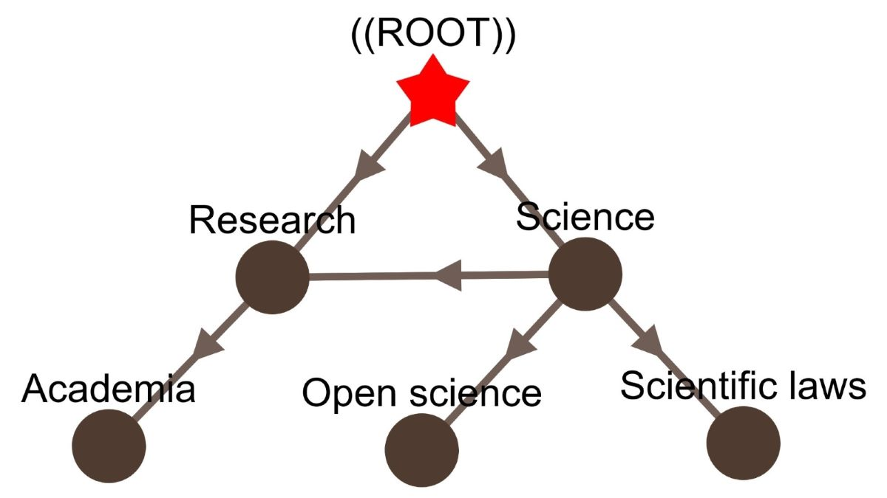

# `wikicat`: A Python toolkit for managing and navigating graphs of Wikipedia categories

|  |  |
|:---:|:---:|
| Interactive Network | UI for finegrained control |


## Main API

The main `wikicat` API allows you work with category graphs generated from a certain dump by Wikipedia. Once the dump is processed via `wikicat.processing`, you can easily navigate the graph using simple and clear Python code, all offline (i.e., you do not need to make web requests to Wikipedia). The API is designed to be as simple as possible, and is intended to be used by researchers and developers who want to work with the Wikipedia category graph.

To install the API, run:

```
pip3 install wikicat
```

`wikicat` contains two classes to work with the Wikipedia category graph: `CategoryGraph` and `Page`. The `CategoryGraph` class is used to load the graph from a file, and to navigate the graph. The `Page` class is used to represent a Wikipedia page, and to retrieve information about the page from Wikipedia. They are meant to be used together, as shown in the following example:

```python
import wikicat as wc

# Load the graph
cg = wc.CategoryGraph.read_json('~/.wikicat_data/category_graph_<yyyymmdd>.json')

# Get the page for "Montreal"
page = cg.get_page_from_title('Montreal', namespace='article')

# Get the categories for "Montreal"
cats = cg.get_parents(page=page)
print(f"Category tags of {page.title}: {cats}")

# Get URL of "Montreal"
print("URL:", page.get_url())
```

You can find the full documentation in the [our repository wiki](https://github.com/xhluca/wikicat/wiki).


## `wikicat.processing`: CLI for processing the Wikipedia category graph

To install the processing tools, run:

```
pip3 install wikicat[processing]
```

To download a dump directly from web archive:

```bash
python3 -m wikicat.processing.download_dump --dump_name dump_<yyyymmdd>.db --year <yyyy> --month <mm> --day <dd>
```

Once you have downloaded a dump, you can generate the graph with:

```bash
python3 -m wikicat.processing.generate_graph --dump_name dump_<yyyymmdd>.db --save_name category_graph_<yyyymmdd>.json
```

The results will be saved in `~/.wikicat_data/category_graph_<yyyymmdd>.json`.


## `wikicat.viewer`: an application to visually explore the category graph

To install the viewer, run:

```bash
pip3 install wikicat[viewer]
```

To run the viewer, run:

```
python3 -m wikicat.viewer --load_name category_graph_<yyyymmdd>.json --port 8050
```

Then, open your browser to `http://0.0.0.0:8050`.

### Accessing components

`wikicat.viewer` was built using [Dash](https://dash.plotly.com/), a Python framework for building web applications. The application is composed of several components, which can be accessed inside `wikicat.viewer.components`. For example, to access the `Network` component, you can run:

```python
import wikicat.viewer.components as comp

# Build the network
cytoscape_graph = comp.build_cytoscape_graph(...)

# Build the right panel
panel = comp.build_panel(...)
```

Those can be reused in your custom Dash application. You can also create your own component and add it to the viewer. For example:

```python
import wikicat.viewer as wcv

# ...

# Define app
app = dash.Dash(__name__, external_stylesheets=[style], title=title, **kwargs)

# Define your custom components
def build_btn(...):
    # ...

# Build regular components
cyto_graph = wcv.components.build_cytoscape_graph(root)
# ...
cards = wcv.components.build_cards(cl=cl, sw=sw)
cards_column = wcv.components.build_card_column(cards)

# Build layout
app.layout = wcv.components.build_layout(...)

# Assign callbacks to make app interactive
wcv.components.assign_callbacks(app=app, ...)

# Run app
run(app=app, ...)
```

See the `wikicat.viewer.build_app()` function for more details.

## Warning

Because of the size of the graph, some parts of the API (such as the viewer and the processing CLI) require a lot of memory. We recommend using a machine with at least 32 GB of RAM. We are working on a more memory-efficient version of the API.